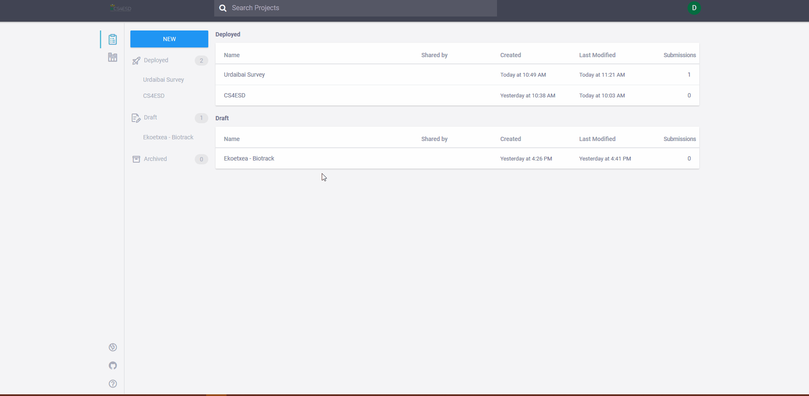
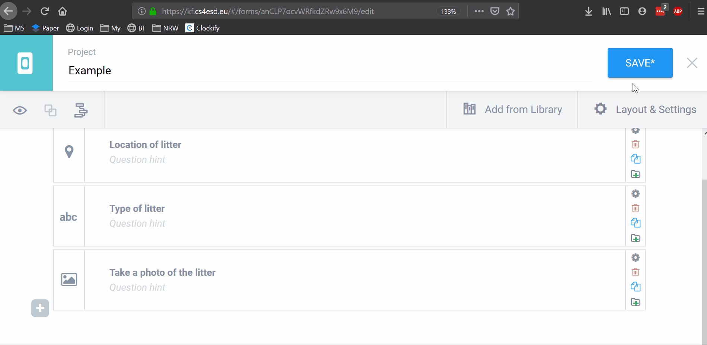
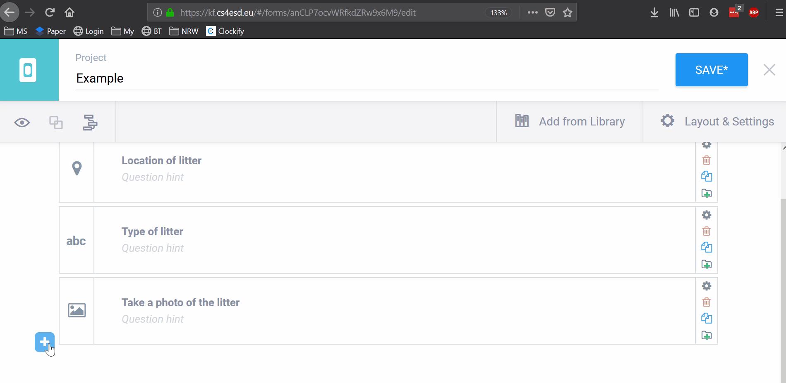
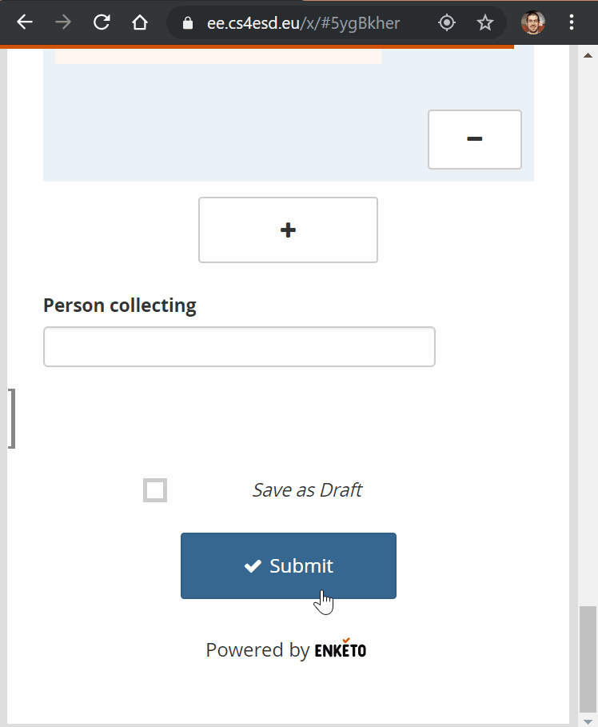
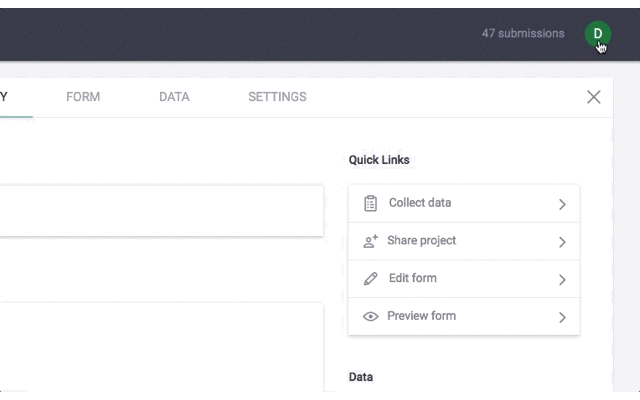

# CS4ESD App

### Logging in

Go to [https://kf.cs4esd.eu](https://kf.cs4esd.eu) and enter the details that you have been provided with \(or register for a new account\).

### 

### Creating a survey and adding questions

### Saving and deploying a survey

### Redeploying a survey after changing or adding questions

### Submitting and uploading surveys

### Changing language for form creation page

### Adding a language translation to a form

To add a translation to a form you need to add the new language and then supply translations for the questions and options. 

#### Adding a new language

You will need the language tag for the language you are adding this can be found at [https://r12a.github.io/app-subtags/](https://r12a.github.io/app-subtags/) by typing the name of the language e.g. the tag for greek languages is grk. You then need to add it by following the video below.

See the below video for how to translate a form that you have created \(apologies the translations were done using Google translate!\).

### Adding media to a survey question

To add media to a question you will need to add the upload the media to the media gallery first \(see video below\) before you can add them to your question.



